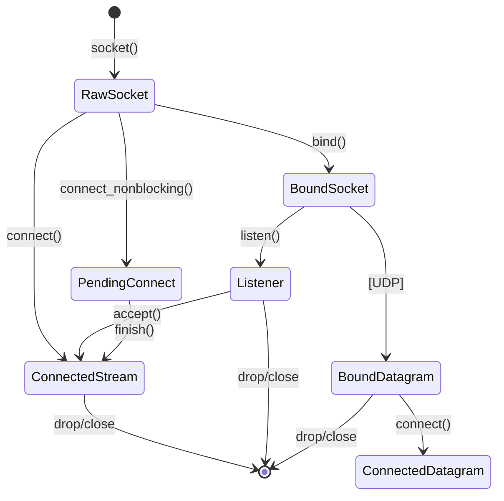
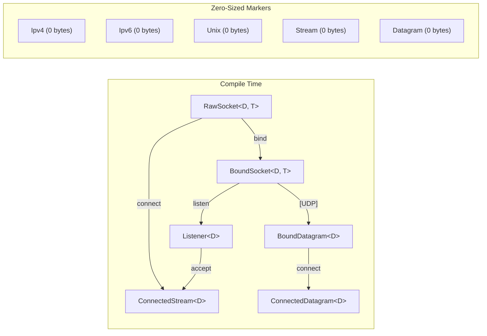
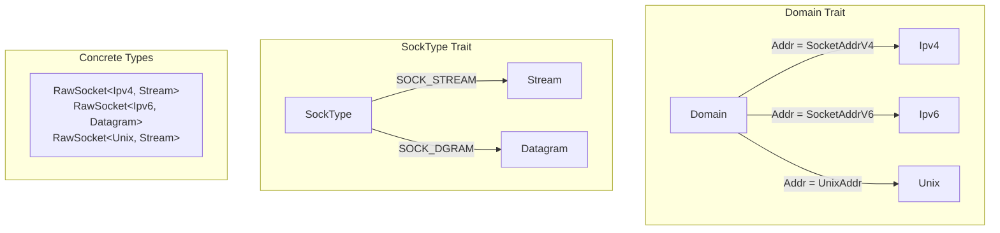
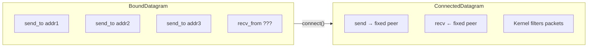
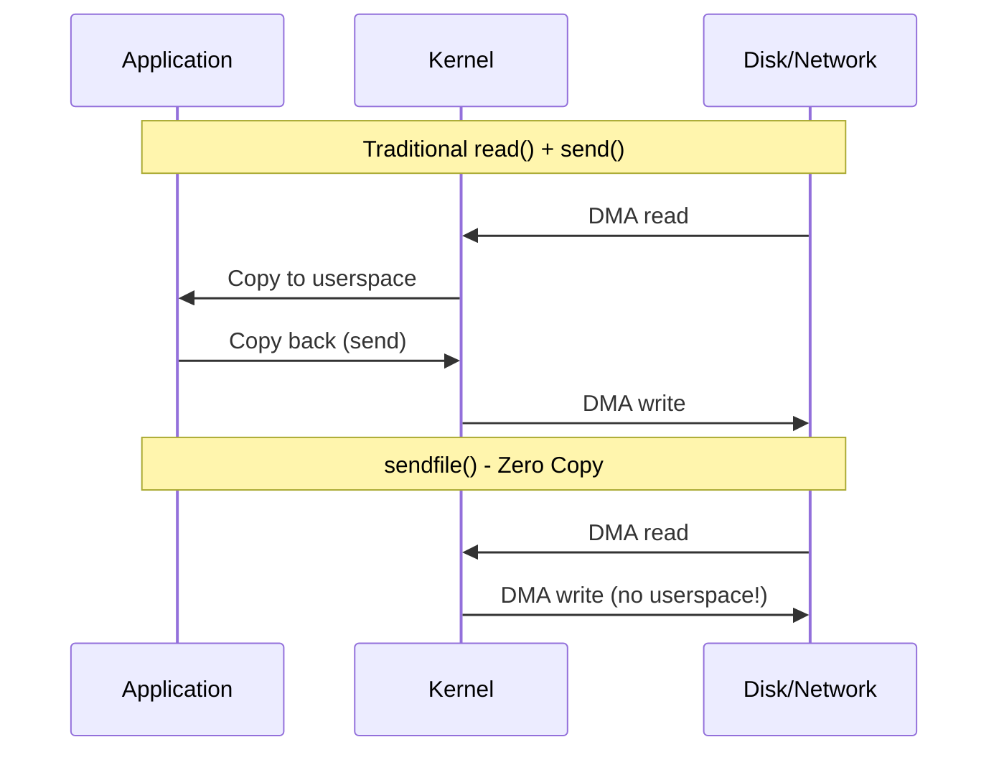
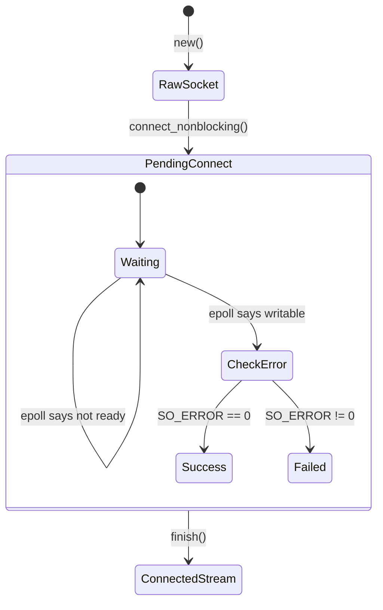
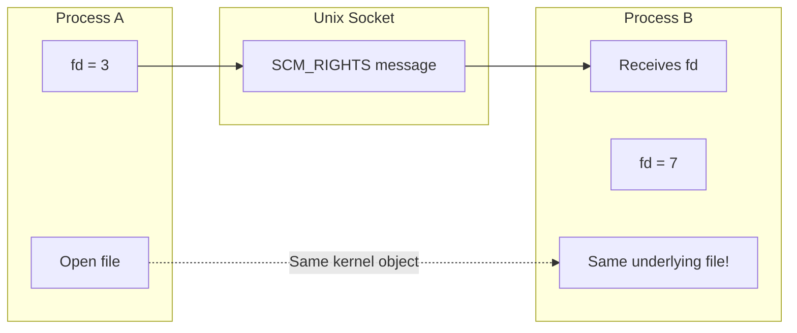
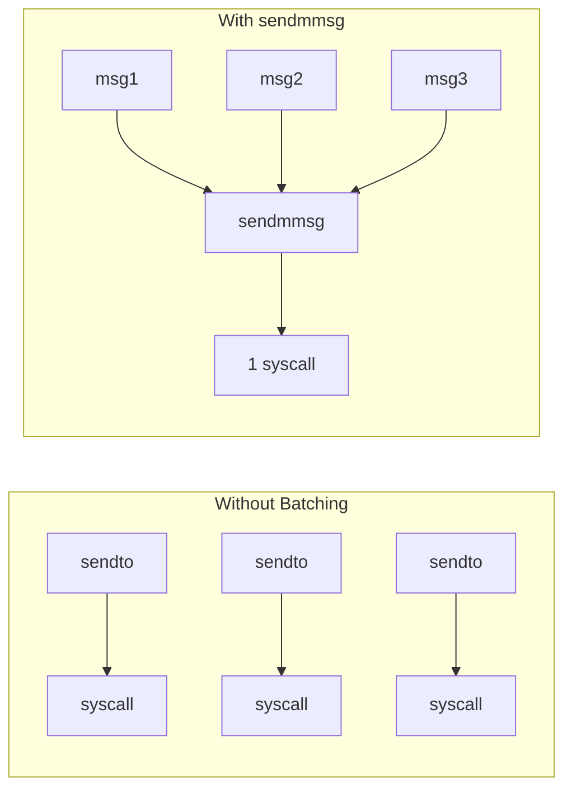

# Wirelane

**Zero-cost, type-safe network sockets for Rust.**

> *The socket state machine, enforced at compile time.*

[](https://www.rust-lang.org)

---
## Educational and Learning Context

This project is developed **for learning and educational purposes**.

Wirelane exists to explore and demonstrate:

- Type-level state machines in Rust
- Typestate as a compile-time correctness mechanism
- Low-level socket semantics and kernel behavior
- Zero-cost abstractions enforced by the type system

Design decisions may prioritize:
- Explicitness over ergonomics
- Compile-time guarantees over flexibility
- Structural correctness over API familiarity

This project should be viewed as:
- A learning and research artifact
- A reference implementation of typestate-driven design
- A foundation for further experimentation

It is **not positioned as a drop-in replacement** for `std::net` or production networking frameworks.

## Why Wirelane?

Traditional socket APIs are **procedural and runtime-validated by design**.
They expose socket operations directly and rely on runtime errors to enforce
correct ordering and state-dependent behavior.

This approach prioritizes:
- Flexibility
- Familiarity
- Minimal type surface area

However, socket state is **implicit**, not represented in the type system.
As a result, invalid state transitions are *expressible in code* and only
rejected when the program executes.

```rust
// std::net: state is implicit, validated at runtime
let socket = TcpStream::connect(addr)?;   // correctness checked at runtime
```
## Wirelane’s Design Choice

Wirelane takes a different approach.

It encodes the socket state machine directly into the type system, making
invalid states unrepresentable and invalid transitions uncallable.
```rust
// Wirelane: state is explicit, validated at compile time
let socket = RawSocket::<Ipv4, Stream>::new()?;
// socket.accept();        // ❌ compile-time error: method does not exist

let bound = socket.bind(addr)?;
// bound.connect(addr)?;   // ❌ compile-time error: invalid transition

let listener = bound.listen(128)?;
let conn = listener.accept()?;  // ✅ valid by construction

```
In Wirelane:

Socket state is explicit in the type

Transitions consume ownership and return new types

Only operations valid for the current state are available

Incorrect usage is rejected before the program can run.
## The Actual Need

Wirelane is **Layer 0** of a high-performance network stack:

```
┌────────────────────────────┐
│ Application / Protocols    │  (HTTP, QUIC, RPC)
├────────────────────────────┤
│ TLS / Crypto               │
├────────────────────────────┤
│ Async model                │  (io_uring / epoll / threads)
├────────────────────────────┤
│ Wirelane                   │  ← socket correctness boundary
├────────────────────────────┤
│ Linux kernel syscalls      │
└────────────────────────────┘

```

### Direct Kernel Interaction

Wirelane operates on raw file descriptors and exposes kernel socket capabilities
directly, without introducing additional runtime state.

###  **Zero-copy requires kernel primitives**

```rust
// sendfile: kernel-to-kernel, no userspace copy
conn.sendfile(&file, offset, len)?;

// splice: pipe ↔ socket without touching userspace
splice(&pipe, &socket, len, SPLICE_F_MOVE)?;
```

### **Batch syscalls for high throughput**

```rust
// sendmmsg: 1 syscall for 64 UDP packets
socket.sendmmsg(&messages)?;  // Gaming, trading, DNS
```

std::net: 64 syscalls. Wirelane: 1.

**4. Socket-Level Tuning**

```rust
set_tcp_cork(&conn, true)?;    // Batch small writes
set_tcp_quickack(&conn, true)?; // Disable delayed ACK
set_tcp_fastopen(&listener, 5)?; // TFO for HTTPS
```

std::net exposes almost none of this.

**5. QUIC needs connected UDP**

```rust
// QUIC uses "connected" UDP for kernel-level peer filtering
let quic = bound_udp.connect(peer)?;
quic.send(packet)?;  // No address lookup, kernel filters incoming
```

std::net::UdpSocket can do this, but without typestate safety.

---

## The Core Insight

### Sockets Are State Machines

Every socket follows a state machine. The BSD socket API lets you violate it. Wirelane enforces it.



Each arrow is a **type transformation**. You literally cannot call `accept()` on a `RawSocket` — the method doesn't exist on that type.

---

## Architecture

### Type-Level State Machine



### Why Zero-Sized Types?

```rust
pub struct Ipv4;      // Size: 0 bytes
pub struct Stream;    // Size: 0 bytes

pub struct RawSocket<D: Domain, T: SockType> {
    fd: OwnedFd,              // 4 bytes (file descriptor)
    _marker: PhantomData<(D, T)>,  // 0 bytes (compile-time only)
}
// Total size: 4 bytes. Same as a raw fd. Zero overhead.
```

The type parameters exist only at compile time. At runtime, `RawSocket<Ipv4, Stream>` is just a 4-byte file descriptor.

---

## The Typestate Pattern

### What Is It?

Typestate encodes **object state in the type system**. State transitions become **type transformations**.

```rust
// State encoded in TYPE, not in a runtime field
fn connect(self, addr: D::Addr) -> Result<ConnectedStream<D>>
//         ^^^^                          ^^^^^^^^^^^^^^^^^
//         Consumes RawSocket            Returns different type
```

## How the Typestate Enforcement Works

### 1. Different types = different socket states

Each kernel socket state is represented by a **different Rust type**.

```rust
RawSocket<D, T>        // Created, unconfigured
BoundSocket<D, T>      // Bound to an address
Listener<D>            // Listening, can accept()
ConnectedStream<D>     // Connected, can read/write
```

There is **no single type** that represents multiple states.
If the kernel state changes, the Rust type must change.

---

### 2. State transitions consume `self` and return a new type

State transitions are encoded as **ownership transfers**.

```rust
pub fn bind(self, addr: D::Addr) -> std::io::Result<BoundSocket<D, T>>
//          ^^^^                                    ^^^^^^^^^^^^^^^^^
//          Consumes RawSocket                      Returns a new state type
```

After `bind()`:

* the original `RawSocket` no longer exists
* it cannot be reused
* it cannot be accessed accidentally

The compiler enforces this mechanically. No runtime checks.

---

### 3. Methods only exist on valid states

Operations are only implemented on the types where they are valid.

* `accept()` → only on `Listener`
* `connect()` → only on `RawSocket<D, Stream>`
* `read()` / `write()` → only on `ConnectedStream`

Example:

```rust
raw_socket.accept(); // compile error: method does not exist
```

This is not a runtime error.
The code cannot compile.

---

### 4. Zero-cost at runtime

All state information exists **only at compile time**.

```rust
pub struct RawSocket<D: Domain, T: SockType> {
    fd: OwnedFd,                    // actual file descriptor
    _marker: PhantomData<(D, T)>,   // zero-sized, compile-time only
}
```

At runtime:

* no enums
* no state fields
* no branches
* no checks

The value is just a file descriptor.

The compiler enforces correctness, then erases the types.

**Runtime cost: zero.**

---

### Compression

* States are types
* Transitions consume ownership
* Inv


---

## Domain & Protocol Abstraction

### One API, Multiple Protocols



```rust
// Same code structure, different protocols
let tcp4 = RawSocket::<Ipv4, Stream>::new()?;
let tcp6 = RawSocket::<Ipv6, Stream>::new()?;
let udp4 = RawSocket::<Ipv4, Datagram>::new()?;
let unix = RawSocket::<Unix, Stream>::new()?;
```

---

## Real-World Design Decisions

### Why `connect()` Consumes Self?

```rust
pub fn connect(self, addr: D::Addr) -> Result<ConnectedStream<D>>
//             ^^^^
//             Takes ownership, not &self
```

**Because a connected socket is a different thing than an unconnected socket.**

After `connect()`:
- You can `send()`/`recv()` (not before)
- You cannot `bind()` (could before)
- You cannot `connect()` again (TCP)

The type change reflects the semantic change.

### Why Separate `BoundDatagram` and `ConnectedDatagram`?



**BoundDatagram**: Communicate with anyone. Must specify address on each send.

**ConnectedDatagram**: Locked to one peer. Kernel filters incoming packets. Faster `send()`/`recv()` (no address lookup). Used by QUIC.

---

## Socket Options Philosophy

### Generic Over Any Socket Type

```rust
pub fn set_tcp_nodelay<S: AsRawFd>(socket: &S, enable: bool) -> Result<()>
//                     ^^^^^^^^^^
//                     Works on ANY type with a file descriptor
```

This works on `RawSocket`, `ConnectedStream`, `Listener` — anything with an fd.

## Explicit State Progression (No Builder, No Abstraction)

This example shows the socket lifecycle **without builders**, **without helpers**, and **without hidden defaults**.  
Each line is a **type-level state transition**, not a configuration step.

```rust
let addr = SocketAddrV4::new([0, 0, 0, 0], 8080);

let socket = RawSocket::<Ipv4, Stream>::new().unwrap();
// Type: RawSocket<Ipv4, Stream>

let bound = socket.bind(addr).unwrap();
// Type: BoundSocket<Ipv4, Stream>

let listener = bound.listen(128).unwrap();
// Type: Listener<Ipv4>
```


### Builder Pattern for Common Configurations

**Composable Config Structs** — reusable across builders:

```rust
// Define once, reuse everywhere
let reuse = ReuseConfig::new().both();        // addr + port for load balancing
let tcp = TcpConfig::new()
    .nodelay(true)
    .keepalive(KeepaliveConfig::new().idle(30).interval(5).count(3));
let buffers = BufferConfig::new().both(65536);

// Apply to listener
let listener = ListenerBuilder::<Ipv4>::new()
    .reuse(reuse)
    .tcp(tcp)
    .buffers(buffers)
    .backlog(4096)
    .bind(addr)?;

// Same configs for connector
let conn = ConnectorBuilder::<Ipv4>::new()
    .tcp(tcp)
    .buffers(buffers)
    .connect(peer)?;
```


---

## Zero-Copy Operations

### The Data Path Problem



### Wirelane's Zero-Copy API

```rust
// sendfile: File → Socket (no userspace copy)
conn.sendfile(&file, Some(&mut offset), 1_000_000)?;

// splice: Pipe ↔ Socket (kernel-to-kernel)
splice(&pipe_read, None, &socket, None, 65536, SPLICE_F_MOVE)?;
```

---

## Non-Blocking Connect

### The Problem

`connect()` on a non-blocking socket returns immediately with `EINPROGRESS`. You need to:
1. Wait for socket to become writable (epoll/io_uring)
2. Check `SO_ERROR` to see if connection succeeded
3. Then use the socket

### Wirelane's Solution



```rust
let pending = socket.connect_nonblocking(addr)?;

// ... wait for epoll/io_uring ...

match pending.take_error()? {
    None => {
        let conn = pending.finish();  // Type transforms!
        // Now you have ConnectedStream
    }
    Some(e) => return Err(e),
}
```

---

## File Descriptor Passing (SCM_RIGHTS)

### Why Pass File Descriptors?



Use cases:
- **Privilege separation**: Open file as root, pass fd to unprivileged worker
- **Socket handoff**: Accept connection, pass to worker process
- **Container runtimes**: Pass namespaced resources between processes

```rust
// Send a file descriptor
send_fd(&unix_socket, &some_file)?;

// Receive it in another process
let received: OwnedFd = recv_fd(&unix_socket)?;
```

---

## Batch Operations (sendmmsg/recvmmsg)

### Why Batch?

Each syscall has overhead (~100-1000 cycles). For high-frequency UDP (gaming, trading), this adds up.



```rust
let messages = vec![
    (b"packet1".as_slice(), addr1),
    (b"packet2".as_slice(), addr2),
    (b"packet3".as_slice(), addr3),
];

// One syscall for all three
let sent_lens = socket.sendmmsg(&messages)?;
```

---
## Quick Start

### TCP Echo Server

```rust
use wirelane::{Ipv4, SocketAddrV4, ListenerBuilder};
use std::io::{Read, Write};

fn main() -> std::io::Result<()> {
    let listener = ListenerBuilder::<Ipv4>::new()
        .reuse_addr(true)
        .bind(SocketAddrV4::new([0, 0, 0, 0], 8080))?;

    println!("Listening on :8080");

    loop {
        let mut conn = listener.accept()?;
        std::thread::spawn(move || {
            let mut buf = [0u8; 1024];
            while let Ok(n) = conn.read(&mut buf) {
                if n == 0 { break; }
                conn.write_all(&buf[..n]).ok();
            }
        });
    }
}
```

### UDP Echo Server

```rust
use wirelane::{Ipv4, SocketAddrV4, DatagramBuilder};

fn main() -> std::io::Result<()> {
    let socket = DatagramBuilder::<Ipv4>::new()
        .bind(SocketAddrV4::new([0, 0, 0, 0], 9000))?;

    let mut buf = [0u8; 1500];
    loop {
        let (n, sender) = socket.recv_from(&mut buf)?;
        socket.send_to(&buf[..n], &sender)?;
    }
}
```

---

## Roadmap

- [ ] Runtime integration (Layer 1)
- [ ] TLS support (Layer 2)
- [ ] HTTP/3 + QUIC (Layer 3)

---

## License

MIT

---

<p align="center">
  <strong>Wirelane</strong>: Where the type system meets the network stack.
</p>